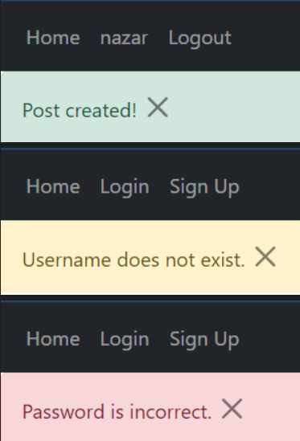

<h1>Flask Posts REST API + Notifications</h1>
This is my pet project, which implements the Login system, RESTAPI, SQLALCHEMY, Notifications. This is a simple post list project designed to help users browse a blog in which each user can add their own post and view other users' posts. The login system allows each user to create and delete their posts, while not receiving such access to changes to the posts of other users. Notifications allow the user to check the correctthis of their actions.

 
<h1>Install and Server run</h1>
<b>Install:</b> pip install requirements.txt

 
<b>Command run:</b> flask --app app run
 

 
<h1>How to add PosgreSQL</h1>
To add a postgreSQL database, there are many different lessons on the Internet, but be sure to add the following data when creating a database: 
user = postgres 
password = 1234 
name_db = blog

 
However, without this data, the postgreSQL database cannot connect to this project.

 
<h1>Features</h1>
<ul>
<li>Add new post to the list.</li>
<li>Delete all post from the list.</li>
<li>Notification messages at user interaction(Colors messages: green, red, yellow)</li>
<li>Added page not found for user</li>
</ul>

<h1>Images project</h1>
PostsList</img>

 

Notification messages (green, yellow, red)

</img>
